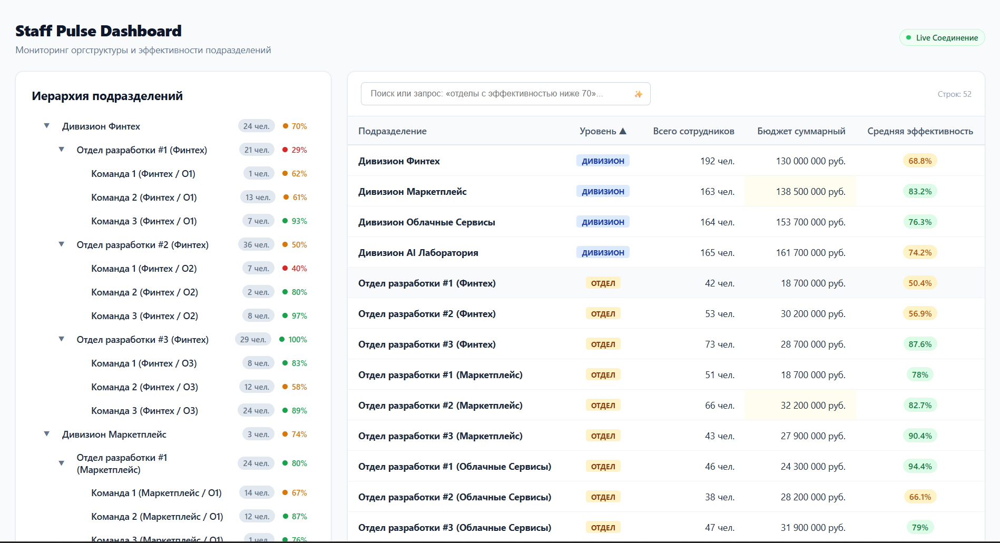

# 🏢 Staff Pulse Dashboard

Интерактивный аналитический дашборд для мониторинга организационной структуры компании в реальном времени. Реализован на React 18, TypeScript и Styled Components без использования сторонних UI-библиотек. Поддерживает двустороннюю синхронизацию дерева и аналитической таблицы (Split-view $\ge 1280$px), live-обновления по WebSocket без сетевого рефетча и доступность с клавиатуры.


---

## ⚡ Быстрый старт

### 1. Локальный запуск одной командой (Node.js $\ge 18$)
Команда одновременно поднимает REST + WebSocket mock-сервер на порту `3001` и клиент Vite на порту `5173`:

```bash
# Установка зависимостей
npm install

# Запуск клиента и бэкенда в параллельном режиме
npm run dev
```

* **Дашборд:** [http://localhost:5173](http://localhost:5173)
* **REST API:** `http://localhost:3001/api/org-tree`
* **WebSocket:** `ws://localhost:3001/ws`

### 2. Запуск через Docker Compose (Production окружение)
Сборка мультистейдж-контейнера с раздачей статики через Nginx с Gzip-сжатием (размер бандла $\le 200$ КБ gzip) и проксированием API:

```bash
docker-compose up --build
```
* **Production UI:** [http://localhost](http://localhost)

### 3. Запуск Unit-тестов
Верификация математического ядра агрегации дерева:
```bash
npm run test
```

---

## 🤖 AI в процессе разработки (Обязательный раздел ТЗ)

Разработка велась в плотной связке с LLM-инструментами (Claude 3.5 Sonnet / Cursor) в качестве парного архитектора. Ниже приведена прозрачная фиксация того, что было сгенерировано, а что переписано вручную с инженерным обоснованием.

### Что генерировалось с помощью AI:
1. **Первичные мок-данные и Zod-схемы:** Генерация 52 связанных узлов оргструктуры с 3 уровнями вложенности и случайными реалистичными бюджетами/метриками.
2. **DevOps-манифесты:** Базовые конфиги `Dockerfile` (мультистейдж сборка), `docker-compose.yml` и блок Gzip-директив в `nginx.conf`.
3. **Каркас тестов Vitest:** Мокирование структуры дерева для модульных тестов.

### Что было переписано руками и почему:
1. **Алгоритм постфиксной агрегации (`src/entities/org/lib/aggregateTree.ts`):**  
   * *Сгенерировано AI:* Наивный рекурсивный алгоритм, в котором для каждого узла вызывался повторный обход всех его потомков. Сложность составляла $O(N^2)$, что приводило к проседанию FPS при частых обновлениях.  
   * *Переписано вручную:* Полноценный Post-order Traversal за строго $O(N)$. Сборка суммарного бюджета, штата и взвешенной эффективности рассчитывается снизу вверх за один проход с мемоизацией результата.
2. **Инкрементальный пересчет предков (`src/entities/org/lib/patchAncestors.ts`):**  
   * *Сгенерировано AI:* При получении WebSocket-сообщения нейросеть запускала полную инвалидацию React Query кэша и ререндерила всё дерево.  
   * *Переписано вручную:* Алгоритм точечного расчета дельт показателей за $O(H)$, где $H \le 3$ (высота дерева). При изменении метрик листовой команды мы высчитываем $\Delta Budget$ и $\Delta Headcount$ и поднимаем их вверх исключительно по цепочке `parentId` до корня. Соседние поддеревья даже не затрагиваются.
3. **Изолированная реактивная подсветка ячеек (`HighlightCell.tsx`):**  
   * *Сгенерировано AI:* Подсветка вешалась на всю строку таблицы целиком через изменение локального стейта компонента `OrgTable`, из-за чего возникали задержки в 200 мс и моргали не те элементы.  
   * *Переписано вручную:* Создан атомный компонент ячейки `<td>`, который хранит предыдущее значение через `useRef` и запускает CSS-анимацию `fade-out ~1.5s` через `requestAnimationFrame`. Это обеспечило мгновенный отклик и изолированный рендер только изменившихся чисел.

---

## 🛠 Технологический стек

* **Базовый стек:** React 18, TypeScript, Vite.
* **Стилизация:** `styled-components` (полный отказ от inline-стилей и сторонних UI-библиотек вроде MUI/AntD).
* **Кэширование данных:** `@tanstack/react-query` (политика stale-while-revalidate, staleTime 5 сек, автоотмена через `AbortSignal`).
* **Валидация контрактов:** `zod` (runtime-проверка ответа сервера).
* **Realtime:** WebSocket сервер с автореконнектом по схеме экспоненциального backoff (1s -> 2s -> 4s -> 8s -> 16s).
* **Тестирование:** `vitest`.

---

## 📁 Структура документации
* 📐 [Архитектурные слои и поток данных](docs/architecture.md)
* 🧬 [Модель данных, алгоритмы и контракт WS-патча](docs/data-model.md)
* 📝 [ADR 001: Выбор стратегии управления состоянием и кэширования](docs/adr/001-state-management.md)