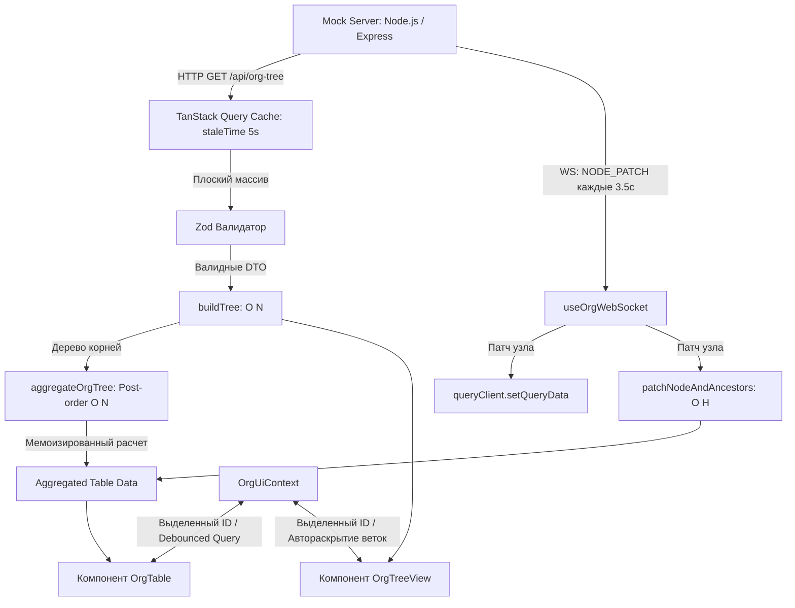

# 🏛 Архитектура приложения Staff Pulse Dashboard[cite: 1]

## 1. Архитектурные Слои (Feature-Driven / Clean Architecture)[cite: 1]

Кодовая база приложения разделена на строго разграниченные слои с однонаправленным потоком зависимостей:

* **`entities/org`** (Бизнес-сущности и математика):
  * Модели данных: `OrgNodeDto`, `TreeNode`, `AggregatedOrgNode`.
  * Валидация контрактов: Zod-схема `OrgTreeResponseSchema`[cite: 1].
  * Чистые функции: `buildTree` (сборка дерева за $O(N)$), `aggregateOrgTree` (постфиксный обход за $O(N)$)[cite: 1], `patchAncestors` (инкрементальный пересчет предков за $O(H)$)[cite: 1]. Слой полностью изолирован от представления.
* **`features/`** (Пользовательские сценарии):
  * `org-tree`: Рендер интерактивной иерархии с индикаторами производительности и плавной анимацией раскрытия через CSS Grid с учетом `prefers-reduced-motion`[cite: 1].
  * `org-table`: Аналитическая таблица с локальной сортировкой по колонкам (двойной клик для инверсии), навигацией стрелками с клавиатуры и точечной подсветкой ячеек[cite: 1].
  * `org-socket`: Хук управления WebSocket-соединением с обработкой обрывов сети и экспоненциальным backoff[cite: 1].
  * `org-search`: Клиентский модуль интеллектуального поиска на естественном языке с фолбэком на текстовую фильтрацию[cite: 1].
  * `org-view`: Синхронизация выделения узлов (`selectedNodeId`) и переключения экранов через React Context (`OrgUiContext`)[cite: 1].
* **`shared/`** (Инфраструктурные хелперы):
  * Форматирование чисел: `formatCurrency` (`Intl.NumberFormat` для отображения в формате `12 345 678 руб.`)[cite: 1].
  * Утилиты: `useDebounce` (дебаунс 250 мс для поиска)[cite: 1].

---

## 2. Поток Данных (Data Flow Diagram)[cite: 1]

---

## 3. Архитектурные оптимизации и производительность

1. **Трансформация $O(N)$ вместо $O(N^2)$:**  
   Сборка дерева из плоского массива бэкенда выполняется в `buildTree` через два прохода с использованием структуры данных `Map`, что исключает квадратичные затраты.
2. **Мемоизация агрегатов:**  
   Полный пересчет оргструктуры (`aggregateOrgTree`) выполняется ровно один раз при первичной загрузке данных и мемоизируется в стейте[cite: 1].
3. **Изолированный Live-патчинг:**  
   При получении дельты показателей по WebSocket не происходит сетевого повторного запроса (refetch)[cite: 1]. Обновление затрагивает только целевой узел и поднимается дельтами вверх по родительским связям ($O(H)$, глубина $\le 3$)[cite: 1].
4. **Атомарный рендеринг ячеек:**  
   Компонент `HighlightCell` инкапсулирует CSS-анимацию затухания желтого фона (`fade-out ~1.5s`) внутри конкретного `<td>`, не вызывая ререндеринга всей таблицы[cite: 1].